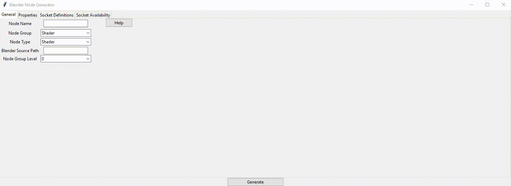

# Blender Node Generator
A tool for generating a new blender shading node


## Running the Tool
To run the tool, download the repository and run main.py using a python interpreter.   
I have developed the tool using python 3.7, 
if you encounter issues running the program make sure you are using a compatible python version

## Undoing Changes
There is currently no undo option in the tool.  
That is why it is important that you use version control so that you can undo any unwanted changes  
Using git, you can run the following command to undo any changes  
```
git reset --hard && git clean -f -d  
```
<b>Be careful you don't have any uncommitted changes you wish to keep!</b>

## Unsupported Use Cases
It's not possible for me to predict how all node variations will be implemented.  
The following use cases aren't fully support(i.e You won't be able to successfully build Blender after running the tool)  
  * Nodes with \> 2 Enum Properties
  * Nodes with string properties
